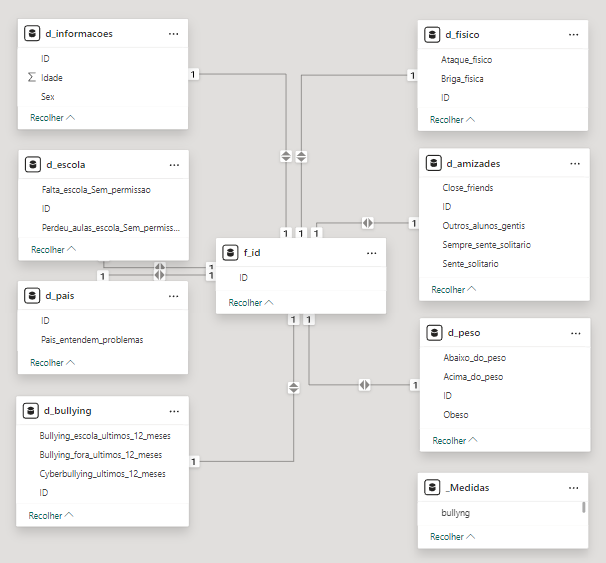
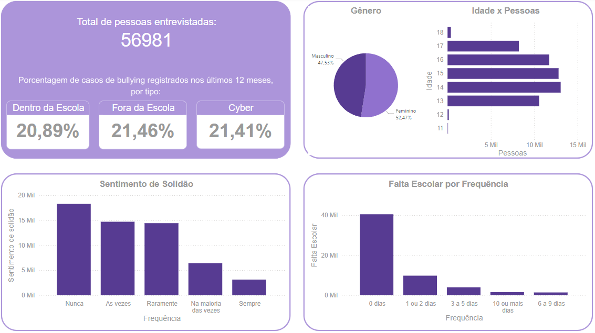

# **Desafio Final - Bullying**

Turma 7 | Data Analytics  
Squad Katherine Johnson

**Integrantes:**

-   Dayna Lilian Figueiredo
-   Fernanda Soares Lima
-   Gabriela Pontes Crespo
-   Maria Elisa Scovino da Silva
-   Nadia Bertoldo Germano dos Santos
-   Nathália Macedo

---

## **Sobre o conjunto de dados**

O Global School-Based Student Health Survey (GSHS) é uma pesquisa escolar que usa um questionário autoaplicável para obter dados sobre o comportamento de saúde dos jovens e fatores de proteção relacionados às principais causas de morbidade e mortalidade.

A pesquisa foi realizada na Argentina em 2018. Um total de 56.981 alunos participaram.

A taxa de resposta da escola foi de 86%, a taxa de resposta do aluno foi de 74% e a taxa de resposta geral foi de 63%.

### **Sobre o desenvolvimento de um modelo de previsão de bullying**

A partir do GHSH, foram selecionadas as perguntas da pesquisa relacionadas ao bullying. Isto com o objetivo de desenvolver um modelo que permita preveni-la.

Alguns dos indicadores de bullying têm sido relacionados a sentimentos de solidão, falta de amigos íntimos, má comunicação com os pais, ausência nas aulas. (por exemplo, Nansel et al. Comportamentos de bullying entre jovens americanos: Prevalência e associação com ajustamento psicossocial). Da mesma forma, jovens identificados por agressores como abaixo do peso, acima do peso e obesos foram vítimas de bullying.

A base de dados contém as seguintes informações:

    • record: código identificador
    • Bullied_on_school_property_in_past_12_months: Sofreu bullying na propriedade da escola nos últimos 12 meses
    • Bullied_not_on_school_property_in_past_12_months: sofreu bullying fora da propriedade da escola nos últimos 12_meses
    • Cyber_bullied_in_past_12_months: Cyberbullying nos últimos 12 meses
    • Custom_Age: Idade
    • Sex: Sexo
    • Physically_attacked: Ataque físico
    • Physical_fighting: Briga Física
    • Felt_lonely: Sentiu-se sozinho
    • Close_friends: Amigos próximos
    • Miss_school_no_permission: Faltam à escola sem permissão
    • Other_students_kind_and_helpful: Outros alunos gentis e prestativos
    • Parents_understand_problems: Os pais entendem os problemas
    • Most_of_the_time_or_always_felt_lonely: Na maioria das vezes ou sempre se sentiu sozinho
    • Missed_classes_or_school_without_permission: Perdeu aulas ou escola sem permissão
    • Were_underweight: Estava abaixo do peso
    • Were_overweight: Estava acima do peso
    • Were_obese: Estava obeso

---

## **Etapas da análise de dados**

A análise da base de bullying foi desenvolvida com os seguintes focos:

### **0 - Tratamento da Base**
- **Limpeza e Tratamento de Nulos**:  
  Devido à quantidade e relevância dos valores nulos nas últimas três colunas, foram criados três modelos diferentes de datasets para fins de análise de diferentes cenários:
  - `df_final`
  - `df_removendo_nulos`
  - `df_categoricos`

  *Consulte o changelog na seção 'recursos importantes' para mais detalhes sobre cada dataset.*

### **1 - Análise dos Dados**
- **Matriz de Correlação**:  
  Cálculo da matriz de correlação para identificar variáveis com relações mais fortes e mais fracas.
- **Análise Exploratória**:  
  - Análise de dados categóricos com visualizações.  
  - Moda de cada variável.
  - Teste Qui-Quadrado para avaliar a análise de correspondência.  
- **Visualizações Gráficas**:  
  Geração de histogramas e boxplots para cada tipo de bullying, separados por gênero e idade.

### **2 - Modelo de Regressão Logística**
- **Construção do Modelo**:  
  Modelo desenvolvido para prever a probabilidade de um indivíduo sofrer bullying na escola. A variável target foi definida como:  
  `Bullied_on_school_property_in_past_12_months`  
  (1 caso o indivíduo tenha sofrido bullying nos últimos 12 meses; 0 caso contrário).
- **Análise de Variáveis Relevantes**:  
  Identificação das variáveis mais impactantes no modelo.
- **Avaliação do Modelo**:  
  Avaliação de desempenho com métricas como:
  - Acurácia  
  - Precisão  
  - Recall  
  - Matriz de confusão (visualização do resultado).

---

## **Recursos Importantes**
Abaixo estão os links para recursos que podem ajudar a entender e acompanhar os progressos realizados durante o desafio:

**Changelog do Código:** Para verificar as alterações das variáveis e a explicação acerca dos datasets gerados ao longo do código, acesse o changelog detalhado aqui: [Changelog do Código.](https://drive.google.com/file/d/11COQhYQZGa8WNYSn6jlRbhkw389pcRIV/view)

**Dashboard do Power BI:** Para explorar o dashboard interativo criado no Power BI, que apresenta visualizações e insights obtidos a partir dos dados analisados: [Dashboard do Power BI.](https://github.com/limasfernanda/desafio_final_bullying_WMC/blob/main/WoMakersCode.pbix)

Esses recursos são essenciais para entender as etapas do processo e visualizar os resultados obtidos.

Aqui temos algumas imagens retiradas do Power BI:

- Modelo Relacional

-   

  
 Figura 1 - Exibição do Modelo
    

- View Power BI

  
 Figura 2 - Panorama geral conjunto de dados 
    

 

  
 Figura 3 - Especificando a idade 15 anos e o gênero Feminino
    

